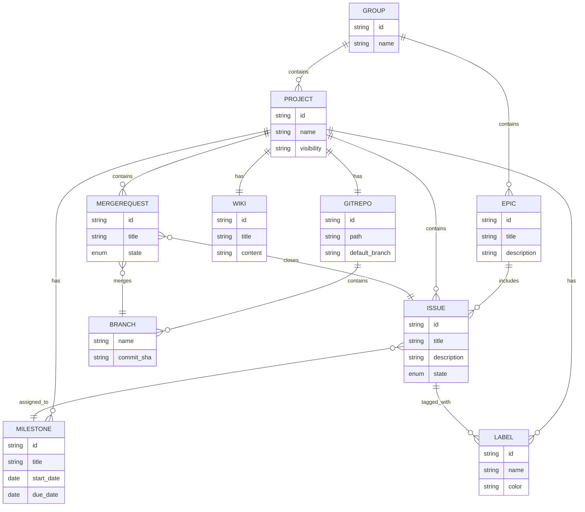
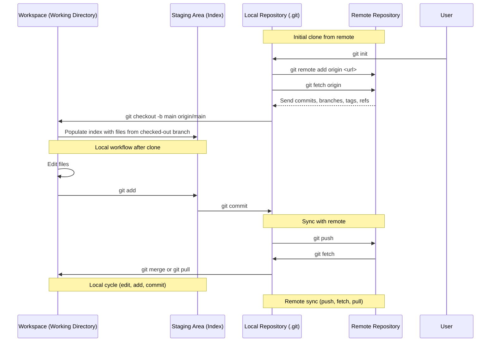

## 06-02-2025

### Submodules

```shell
git clone --recurse-submodules <repo-url>
cd <repo-dir>
git fetch --tags
git checkout v1.2.3
git submodule update --init --recursive
```

### gitlab erd diagram



### transcript of "The Unreasonable effectiveness of Plain Text" by No Boilerplate

<details>

Hi friends, my name is Tris and this is
No Boilerplate, focusing on fast technical videos. All good teams are alike. Each bad team is bad in its own way. Software is an incredible thing, isn't it? Combined with the internet,
a small team of friends can change the world over night. Every company no matter what their industry must now run 
a tech team, even if only to maintain their website. So why are they all so bad at it? Everything you see in this video — script, links and images —
are part of a plain text markdown document available freely on GitHub under a public domain license. If you've worked in a web team, tech team, or any
digital creative team, you've likely felt the pain: bad software, constantly changing processes, and lots and lots of meetings. I discussed some of these problems in my Agile video that made me
a lot of friends, but today, I want to go bigger. You can solve all these problems in a single blow.
The secret is: in order to do more, you must have the discipline to do less. A lot of the ideas that I will mention today are not new.
They've been understood in the startup and digital world for a long time. But regression to the mean is prevalent. It's not just enough to argue for good tools today, you must stop the future churn of
new absent processes that solve the same things in different but equivalent ways. And you do this with a Ulysses pact. In The Odyssey, Odysseus (confusingly called Ulysses in English literature)
had to travel through siren-infested waters. This was a well-understood problem in his world.
Sailors would simply solve this by putting wax in their ears, so the sirens' tempting song wouldn't lure them to their deaths. But Odysseus had a challenge: He WANTED to hear the Sirens' beautiful song. He certainly didn't want to drown, so he ordered
his crew to tie him to the mast of the ship, and to ignore any of his pleas to let him go, until safety. This way, he was able to guard against future bad decisions he knew he would make by setting up a framework to control his future self. This is the Ulysses pact, and it's a very common trick: - leaving your credit card or keys at home when going out drinking
is a Ulysses pact, - publishing a warrant canary on your company's website
is a Ulysses pact, - and standardising all your tools on plain text
is a Ulysses pact. In the future, you, or your successor, or your team might well be
tempted to try the latest hot project management software,
or documentation tool or scrum system. While it might be good for a while, the act of changing tools
constantly is an enormous overhead for your team, and one that gives the lasting impression that anything we write down
is likely to be legacy very soon, trapped in a deprecated app that "we just don't use anymore",
so why bother writing anything down. Tying yourself to the mast by standardising on one tool, and
not only that, but a plain text tool, means your data will live forever, and the network effect can make it more and more valuable over time, instead of less and less. Teams of people need to be on the same page. Both literally and figuratively. The natural way to do this is by talking to one another.
But talking does not scale, and is extremely impermanent. After the sound waves have bounced off the walls and reverberated for a second After the sound waves have bounced off the walls and reverberated for a second. After the sound waves have bounced off the walls and reverberated for a second.. After the sound waves have bounced off the walls and reverberated for a second... the words are gone, and what is left is our memory of them. Human memory is extremely unreliable, subjective, and the root cause of many problems. After a discussion, it is not apparent that everyone
has agreed upon exactly the same thing. And you now need another meeting to double-check that. The solution is documentation. Communication is most reliable when it is in black and white. Everyone understands this, from 10,000-page government specifications
to an email sign-off from the client you're making a 3-minute track for. Yes, have more immediate conversations, by video, or chat, but
write down what you concluded, and get the other person to confirm it. You can improve every part of your team, business, or organisation
by recording what decisions you have made, and WHY, in a system that allows for asynchronous discussion and improvements. The ADR process is excellent for this, for example.
There are a thousand competing apps that claim to solve these problems for you. These apps all re-invent the wheel in their own way,
and new ones are being released every week. I've used most of them, perhaps you have too, and they're all rubbish. But there is a group of people who are extremely practised
at managing enormous distributed, concurrent, text projects: Programmers! As an example, if you use Google Docs, your small team can collaborate
on a few files a day, in a drive of perhaps a hundred or two hundred. And just like in most other documentation systems, that won't scale. Programmers simultaneously edit thousands of files a day,
across repositories of data so numerous that we don't keep count. What are programmers using, and can non-programmers use it too? The answer is yes, yes we can. I recommend you use the most popular distributed
version control system on the planet: Git. You'll use this through one of the many git web hosts,
the largest of which is GitHub, which I recommend for most people. Though I mention GitHub primarily in this video, I'm not sponsored by them, or anything like that, I just acknowledge that popularity matters. Support, experience, and integrations with other services
will all be far, far easier if you use the standard. All these tools started as a web interface around the incredible tool: Git. By the way, the creator of Linux, Linus Torvalds,
also later created git, to solve the problem that he created: that the Linux project had become SO LARGE that
existing plain text collaboration tools were not scaling. He jokes that he named his first project, Linux, after himself,
and so it was natural to name the second one after himself too! From simple code-hosting beginnings, these git services
have grown to be so much more than that, trusted by the largest projects in the world,
built by the largest companies in the world. The foundation of my ideal team uses the raw materials that GitHub has given us. What are the raw materials? I'll show this with a demo: we're going to build
a GitHub organisation for No Boilerplate. This video is not sponsored by GitHub,
my work is possible thanks to viewers like you. If you'd like to see and give feedback on my videos up to a week early,
as well as get discord perks, and even your name in the credits, it would be very kind of you to check my Patreon. I'm also offering a limited number of mentoring slots. If you'd like one-to-one tuition on Rust, Python, Web tech,
Personal organisation, or anything that I talk about in my videos, do sign up and let's chat! It's just me running this channel, and
I'm so grateful to everyone for supporting me on this wild adventure. Let's make our plain text team: The foundational unit with any git host is the repo. This doesn't just correspond with one git repository, but one logical project or subproject. Organisational tools like the Wiki (for documentation),
Projects (for project management) and more can sit here, right next to your project's files, right where you need them. Each GitHub repository has a wiki, a folder of linked markdown files that anyone with access can edit, either in the friendly web editor, or, by cloning the wiki with git, on their own computer with whatever editor they like. This is the minimum viable documentation tool, and it's
useful for when git's full collaboration system isn't needed, and you just want to throw some linked markdown files together quickly. Github, GitLab, and most of the Internet have standardised on Markdown. Just like Slack, Discord, many websites, and sometimes
Facebook depending on the phase of the moon, they all format text using this lightweight standard called Markdown. Markdown is my favourite text format, it's really simple to use, and
is designed to look good both in plain text and rendered as rich text, unlike HTML, which is unreadable by most people unless rendered in a browser. Here we've got a heading, denoted by the hash symbol, italic with underscores,
bold with double asterisks, and links using this bracket pairing syntax. There are a few more options available, which you can look up at markdownguide.org, but this is the overwhelming majority of formatting you'll need on a day-to-day basis. The genius of storing your data in this universal plain-text format is that
should you wish to migrate from GitHub to another similar platform, your data is portable and under your control. GitHub formats Markdown very nicely, but you can export it in any format you like, and edit it with any tool you like, present and future. Including my favourite tool here, Obsidian. Markdown keeps your team focussed on what is important by
allowing you just enough formatting, but no rich customisation options. You're not making a beautiful client brochure, so you shouldn't use 90's
desktop publishing tools to make your company's critical documentation. Back to GitHub's features: Though not part of the git system,
Issues are a natural addition that all git hosts have implemented: A simple task system for capturing work that needs doing. These could be new features, customer requests, bug reports, or ideas. They have a rich comment thread for discussion, can be
assigned to team members, and tagged with custom tags. This minimum viable project management system could be all you need. Certainly, for a solo or small team, capturing requirements in Issues might be enough. But if you need more, you need Milestones. GitHub milestones are a grouping of issues with a deadline. They typically represent a target, a release,
or something the team is working towards. Milestones just have a title, a description, and a date. No burndown charts, no swim lanes, no complex statistics, just a progress bar. This might be enough project management for you.
If not, it is time for GitHub Projects. Each GitHub repo, team, and organisation can have a project board, a lightweight kanban board with customisable columns,
allowing you to group your issues together, and observe their progress through your current iteration. This represents the information radiator for your team,
a bird's-eye view of what is happening with the project, and something you might gather around for your morning catchup meeting. You don't need all the features of Trello, JIRA, or anything like that.
You need the minimum viable board. This bare-bones tool completely side-steps 'the JIRA effect', which is if you have a tool that is packed
full of time tracking, velocity points, and so on the temptation is to use all these features,
even if they give no value and complicate your processes. If you have one meeting a day, it should be a standup.
Good standups replace other meetings and accelerate your project dramatically. The way I like to do standups is not by asking everyone
what they did yesterday and what they intend to do today. That's a great way to find out at length what Dave did on his day off, but not a good way to find out what's happening with the project specifically. I recommend walking your board, backwards, from right to left.
Everyone is timeboxed, keeping the meeting tight. If you don't have an issue on the board, you don't speak yet. Perhaps
you could write or pick up a task from the backlog and talk about it tomorrow. At the end, the team member who is facilitating the meeting
asks if anyone has any blockers, and we're done. The most important part of this most important meeting
is asking if you have any blockers. A good standup means that no-one can get lost or delayed by more than 24 hours. Note I didn't say the PM or DM or scrum master or whoever facilitates. That person doesn't exist in my team.
These are not roles, they are hats. I don't know if your team needs any other meetings,
but it is vital that you do a standup. Back to GitHub. GitHub provides an umbrella group of users called an organisation. This is your company, and if you're building your products in the open,
as I recommend you do, you won't pay GitHub a thing. Most git hosts provide their services for free for open-source companies. If you have too much money, you can pay GitHub for a plan to make your data closed. If you require more subdivision, Organisations are divided into Teams. Teams on GitHub allow you to granularly scope repo, project, wiki,
and other permissions to the different teams in your organisation. I recommend allowing everyone to write and contribute to all projects, you want the network effect and low admin overhead.
This pattern is called "internal open source". But if you wish, perhaps for regulatory reasons,
read and write access to repos can be restricted by team. Now we're getting into the detail of GitHub. I adore pull requests, sometimes called merge requests in other systems. PRs represent a change to the files in a repo,
with an explanation of what you did, some links, and a discussion. After the discussion is satisfied, perhaps as simply as a colleague saying "LGTM" or as heavy weight as a full change review with
an audit trail that would satisfy a bank, the changes are merged into the repo. PRs can have powerful automation, called Actions. PRs and actions can run your company for you if you let them. Though Actions were built for running tests on source code,
with a little imagination, they can be used for anything: - If you're uploading vector images, an action can
build all the rasterised resolutions the client wants. - If you're uploading video or audio clips, an action can
run them through plugins to remove noise, add a music track, and upload the draft to YouTube. If you're checking in company documents, an action can simply spellcheck it. Actions can run hundreds of times an hour,
always adhere to best practice, and never make mistakes. Automating your company gives you an enormous
competitive speed and quality advantage. You could also, for example, set up style guide enforcement,
blocking the PR if the phrase "on premise" has been found. When your company's code, visual assets, and administration,
are all in git repositories, you gain another huge superpower. All of this becomes accessible offline.
Every file, every photo, every design, and document can be on your computer. The magic of offline isn't necessarily that you don't need the internet
(though that is a handy feature on a plane) but that it's FAST, the data is RIGHT HERE on your computer
and you can do ANYTHING with it. If you need to change the company's name across 10,000 files, it's trivial.
It's find and replace. If you, instead, had 5-15 different web services
that you scattered all your team's data across, you'd have to log in to each one, and hope they had
the feature to find and replace within their own walled garden. Most, somehow, don't have this basic feature. GOOGLE DOCS doesn't have this basic feature:
you can't find and replace across a drive of files! And the reason for this, I suspect, is that would be TERRIFYING, wouldn't it? What if a new hire accidentally did that, you'd have to
roll back all those files manually, that could take days! But with git, it would be a PR, clearly showing what was happening,
and mistakes are trivial to fix. Plain-text files, with just enough Markdown syntax to convey meaning, allow you and your team to work with this data in the way that they want, not the way that Google or Atlassian or whoever thinks is best. Doesn't this take up a lot of space on your disk? Not plain text. But even if you're storing large files, storage is cheap if you're smart.
A topic for another video, perhaps. The benefits of git, especially for teams already using it for code and text collaboration, are that 1. you're already paying for it, and
2. it's never going away. It is impossible to imagine a management reshuffle that might decide
on another tool just because it is the flavour of the month. Git and GitHub dominate the coding world, and I recommend GitHub not only because it is the biggest
but also the most featureful. Even if you don't think git and plain text are the best option,
I still suggest you use them because stability is far, far better than a constantly churning tool choice, as staff come, and go and fashions change,
and Google decommission another product. RIP Jamboard :'c You can't do all these utopian things in most companies, I'm painfully aware. But you CAN do SOME of these things,
even just in your immediate team, or only for yourself. I'd be interested to know what other ways good teams
buck the hype cycle in favour of sane, evidence-based improvements. Thank you. If you would like to support my channel, get early ad-free and tracking-free videos,
VIP discord access or one-to-one mentoring, head to https://patreon.com/noboilerplate. If you're interested in transhumanism and hopepunk stories,
please check out my weekly sci-fi podcast, Lost Terminal. Or if urban fantasy is more your bag, do listen to a strange and
beautiful podcast I produce every full moon called Modem Prometheus. Transcripts and compile-checked markdown source code are available on GitHub, links in the description, and corrections are in the pinned ERRATA comment. Thank you so much for watching, talk to you on Discord.

</details>

### Git workflow diagram

This shows git workflow



### robo push


```python
#!/usr/bin/env python3

import os
import shutil
import git
import gitlab
import sys
import datetime
import subprocess

# CONFIGURATION
REPO_URL = 'https://example.com/origin-repo.git'
NEW_REMOTE_URL = 'https://example.com/new-remote.git'
CLONE_DIR = r'C:\path\to\local\folder'
GITLAB_URL = 'https://gitlab.com'
GITLAB_TOKEN = 'YOUR_GITLAB_ACCESS_TOKEN'
PROJECT_ID = 'namespace/project'  # e.g., 'mygroup/myrepo'
ISSUE_TITLE = 'Automated Push: Need to push updates'
ISSUE_LABEL = 'automated-push'
TARGET_BRANCH = 'develop'
LOG_DIR = r'C:\path\to\log'
RETENTION_DAYS = 30

# Set daily log filename
today_str = datetime.datetime.now().strftime('%Y-%m-%d')
LOG_FILE = os.path.join(LOG_DIR, f'git_push_task_{today_str}.log')

def log(message):
    timestamp = datetime.datetime.now().strftime('%Y-%m-%d %H:%M:%S')
    entry = f"[{timestamp}] {message}"
    print(entry)
    with open(LOG_FILE, 'a') as f:
        f.write(entry + '\n')

def delete_old_logs():
    cutoff = datetime.datetime.now() - datetime.timedelta(days=RETENTION_DAYS)
    for filename in os.listdir(LOG_DIR):
        if filename.startswith('git_push_task_') and filename.endswith('.log'):
            file_path = os.path.join(LOG_DIR, filename)
            file_time = datetime.datetime.fromtimestamp(os.path.getmtime(file_path))
            if file_time < cutoff:
                os.remove(file_path)
                print(f"🧹 Deleted old log file: {filename}")

def delete_log():
    if os.path.exists(LOG_FILE):
        os.remove(LOG_FILE)
        print(f"🧹 Deleted today’s log file: {LOG_FILE}")

def check_git_remote(url):
    try:
        subprocess.run(['git', 'ls-remote', url], check=True, capture_output=True, text=True, timeout=30)
        log(f"✅ Remote reachable: {url}")
        return True
    except subprocess.CalledProcessError as e:
        log(f"❌ Failed to reach {url}: {e.stderr.strip()}")
        return False
    except subprocess.TimeoutExpired:
        log(f"❌ Timeout when reaching {url}")
        return False

def create_gitlab_issue(gl, project):
    issue = project.issues.create({'title': ISSUE_TITLE, 'description': 'Preparing to push updates...', 'labels': [ISSUE_LABEL]})
    log(f"📌 Created issue #{issue.iid}")
    return issue

def update_gitlab_issue(issue, message, close=False):
    issue.notes.create({'body': message})
    if close:
        issue.state_event = 'close'
        issue.save()
        log(f"✅ Closed issue #{issue.iid}")

def remove_folder(path):
    try:
        shutil.rmtree(path)
        log(f"🗑️ Removed existing folder: {path}")
    except PermissionError:
        log(f"⚠️ Permission error when removing {path}. Ensure no files are open.")
        sys.exit(1)

def check_existing_issue(gl, project):
    issues = project.issues.list(state='opened', labels=[ISSUE_LABEL])
    if issues:
        log(f"⚠️ Found existing open issue with label '{ISSUE_LABEL}'. Skipping today's run.")
        return True
    return False

def main():
    try:
        print("=== Starting automated push task ===")
        delete_old_logs()

        gl = gitlab.Gitlab(GITLAB_URL, private_token=GITLAB_TOKEN)
        project = gl.projects.get(PROJECT_ID)

        if check_existing_issue(gl, project):
            delete_log()
            return

        issue = create_gitlab_issue(gl, project)

        origin_ok = check_git_remote(REPO_URL)
        new_remote_ok = check_git_remote(NEW_REMOTE_URL)

        if not origin_ok or not new_remote_ok:
            raise Exception("One or both Git remotes are unreachable. Aborting push.")

        if os.path.exists(CLONE_DIR):
            remove_folder(CLONE_DIR)

        log(f"🔧 Cloning repository from {REPO_URL}")
        repo = git.Repo.clone_from(REPO_URL, CLONE_DIR)

        log("🔧 Resetting to last commit")
        repo.git.reset('--hard')

        repo.git.config('core.autocrlf', 'input')

        log(f"🔧 Adding new remote {NEW_REMOTE_URL}")
        if 'new-remote' in repo.remotes:
            repo.delete_remote('new-remote')
        repo.create_remote('new-remote', NEW_REMOTE_URL)

        log(f"🚀 Pushing to develop branch on new-remote")
        repo.remotes['new-remote'].push(refspec=f'HEAD:{TARGET_BRANCH}')

        update_gitlab_issue(issue, "✅ Push operation completed successfully.", close=True)
        delete_log()

    except Exception as e:
        error_message = f"❗ Script encountered an error: {str(e)}"
        log(error_message)
        try:
            with open(LOG_FILE, 'r') as f:
                log_content = f.read()
            issue_body = f"❌ Push operation failed. See log:\n```\n{log_content}\n```"
            if 'issue' in locals():
                update_gitlab_issue(issue, issue_body, close=False)
            else:
                issue = project.issues.create({'title': ISSUE_TITLE, 'description': issue_body, 'labels': [ISSUE_LABEL]})
                log(f"📌 Created error issue #{issue.iid}")
        except Exception as inner_e:
            log(f"❗ Failed to update GitLab issue: {str(inner_e)}")
        finally:
            delete_log()

if __name__ == '__main__':
    main()

```

### git summary

```python

import git
import argparse
import collections
from datetime import datetime
from pathlib import Path


def format_changes(stats, commit_hexsha, change_type):
    insertions = stats['insertions']
    deletions = stats['deletions']
    short_sha = commit_hexsha[:7]

    link = f"[{short_sha}]({commit_hexsha})"

    if change_type == 'A':
        return f"🆕 {link}"
    elif change_type == 'D':
        return f"🔥 {link}"
    else:
        return f"➕{insertions} ➖{deletions} {link}"


def build_file_tree(modified_files):
    tree = {}

    for rel_path, commit_infos in modified_files.items():
        parts = rel_path.split('/')
        current = tree

        for part in parts[:-1]:
            current = current.setdefault(part + '/', {})
        current[parts[-1]] = commit_infos

    return tree


def render_tree_details(tree, depth=1):
    """Render the tree inside > blockquotes + details blocks, with spaced lines."""
    output_lines = []
    block_prefix = "> " * depth

    folders = [k for k in tree if isinstance(tree[k], dict)]
    files = [k for k in tree if not isinstance(tree[k], dict)]

    for folder in sorted(folders):
        output_lines.append(f"{block_prefix}<details>")
        output_lines.append(f"{block_prefix}<summary>{folder}</summary>")
        output_lines.append(f"{block_prefix}")  # blank line after summary

        child_lines = render_tree_details(tree[folder], depth + 1)
        output_lines.extend(child_lines)

        output_lines.append(f"{block_prefix}</details>")
        output_lines.append(f"{block_prefix}")  # blank line after closing details

    for file in sorted(files):
        commit_infos = tree[file]
        commit_summary = " ".join(
            format_changes(stat, sha, change_type)
            for stat, sha, change_type in commit_infos
        )
        output_lines.append(f"{block_prefix}{file} {commit_summary}")
        output_lines.append(f"{block_prefix}")  # blank line after each file

    return output_lines


def compute_statistics(commits):
    file_counts = collections.Counter()
    line_counts = collections.Counter()
    ext_counts = collections.Counter()
    modified_files = collections.defaultdict(list)

    for commit in commits:
        if len(commit.parents) > 1:
            continue  # skip merge commits

        sha = commit.hexsha
        diffs = commit.diff(commit.parents[0]) if commit.parents else []

        for diff_item in diffs:
            file_path = diff_item.b_path or diff_item.a_path
            change_type = diff_item.change_type  # A, D, M, R, etc.

            stats = commit.stats.files.get(file_path, {"insertions": 0, "deletions": 0})
            added = stats['insertions']
            deleted = stats['deletions']

            if change_type == 'A':
                file_counts['added'] += 1
            elif change_type == 'D':
                file_counts['deleted'] += 1
            else:
                file_counts['modified'] += 1

            line_counts['added'] += added
            line_counts['deleted'] += deleted

            ext = Path(file_path).suffix or '[no_ext]'
            ext_counts[ext] += 1

            # Only store the first commit for this file
            if file_path not in modified_files:
                modified_files[file_path].append((stats, sha, change_type))

    return file_counts, line_counts, ext_counts, modified_files


def write_report(output_path, branch, file_counts, line_counts, ext_counts, file_structure_lines):
    with open(output_path, 'w') as f:
        f.write(f"# Git Changes Report\n\n")
        f.write(f"## Branch: {branch}\n\n")

        # Files added/deleted/modified pie
        f.write("```mermaid\npie\n")
        f.write("    title Files Added / Deleted / Modified\n")
        f.write(f"    \"Files Added\" : {file_counts['added']}\n")
        f.write(f"    \"Files Deleted\" : {file_counts['deleted']}\n")
        f.write(f"    \"Files Modified\" : {file_counts['modified']}\n")
        f.write("```\n\n")

        # Lines added/removed pie
        f.write("```mermaid\npie\n")
        f.write("    title Lines Added vs Removed\n")
        f.write(f"    \"Lines Added\" : {line_counts['added']}\n")
        f.write(f"    \"Lines Removed\" : {line_counts['deleted']}\n")
        f.write("```\n\n")

        # File extension pie
        f.write("```mermaid\npie\n")
        f.write("    title Changes by File Extension\n")
        for ext, count in ext_counts.items():
            f.write(f"    \"{ext}\" : {count}\n")
        f.write("```\n\n")

        # Tree with collapsible details and blockquotes
        f.write("## Project Tree with Changes\n\n")
        for line in file_structure_lines:
            f.write(f"{line}\n")

        f.write("\n")


if __name__ == "__main__":
    parser = argparse.ArgumentParser(description="Generate a Git markdown report with collapsible >-style file tree and stats.")
    parser.add_argument("repo_path", help="Path to the Git repository")
    parser.add_argument("--branch", default="main", help="Branch to analyze")
    parser.add_argument("--since", required=True, help="Start date (YYYY-MM-DD)")
    parser.add_argument("--output", default="git_changes_report.md", help="Output markdown file name")

    args = parser.parse_args()

    repo = git.Repo(args.repo_path)
    commits = list(repo.iter_commits(args.branch, since=args.since))

    file_counts, line_counts, ext_counts, modified_files = compute_statistics(commits)
    file_tree = build_file_tree(modified_files)
    file_structure_lines = render_tree_details(file_tree, depth=1)

    write_report(args.output, args.branch, file_counts, line_counts, ext_counts, file_structure_lines)

    print(f"✅ Report written to {args.output}")


```

### mega clone

```python
import os
import subprocess
import gitlab
from concurrent.futures import ThreadPoolExecutor, as_completed
from rich.progress import Progress, SpinnerColumn, BarColumn, TextColumn, TimeElapsedColumn

# === CONFIGURATION ===
GITLAB_URL = 'https://gitlab.com'  # Change if self-hosted
PRIVATE_TOKEN = 'your_private_token_here'
ROOT_GROUP_NAME = 'my-team-group'
MAX_WORKERS = 4  # Adjust number of parallel clones

# === SETUP ===
gl = gitlab.Gitlab(GITLAB_URL, private_token=PRIVATE_TOKEN)
gl.auth()

def safe_makedirs(path):
    try:
        os.makedirs(path, exist_ok=True)
    except Exception as e:
        print(f"❌ Failed to create directory {path}: {e}")

def clone_project(project, local_path):
    try:
        clone_url = project.ssh_url_to_repo
        target_dir = os.path.join(local_path, project.path)
        if os.path.exists(target_dir):
            return f"✅ Already cloned: {target_dir}"
        subprocess.run(['git', 'clone', '--recursive', clone_url, target_dir], check=True)
        return f"🌟 Cloned: {clone_url} into {target_dir}"
    except subprocess.CalledProcessError as e:
        return f"❌ Clone failed for {clone_url}: {e}"
    except Exception as e:
        return f"❌ Error cloning {clone_url}: {e}"

def collect_projects(group):
    projects = []
    projects.extend(group.projects.list(all=True))
    for subgroup in group.subgroups.list(all=True):
        subgrp = gl.groups.get(subgroup.id)
        projects.extend(collect_projects(subgrp))
    return projects

def process_group(group, local_path):
    group_path = os.path.join(local_path, group.path)
    safe_makedirs(group_path)

    tasks = []
    projects = group.projects.list(all=True)
    for project in projects:
        proj = gl.projects.get(project.id)
        tasks.append((proj, group_path))

    for subgroup in group.subgroups.list(all=True):
        subgrp = gl.groups.get(subgroup.id)
        tasks.extend(process_group(subgrp, group_path))

    return tasks

def main():
    root_group = gl.groups.get(ROOT_GROUP_NAME)
    safe_makedirs(ROOT_GROUP_NAME)
    all_tasks = process_group(root_group, '.')

    results = []
    with Progress(
        SpinnerColumn(),
        TextColumn("[progress.description]{task.description}"),
        BarColumn(),
        TextColumn("[progress.percentage]{task.percentage:>3.0f}%"),
        TimeElapsedColumn(),
    ) as progress:
        task = progress.add_task("Cloning repositories...", total=len(all_tasks))
        with ThreadPoolExecutor(max_workers=MAX_WORKERS) as executor:
            future_to_project = {executor.submit(clone_project, proj, path): proj for proj, path in all_tasks}
            for future in as_completed(future_to_project):
                result = future.result()
                results.append(result)
                progress.advance(task)

    print("\n--- Summary ---")
    for r in results:
        print(r)

if __name__ == '__main__':
    main()
```