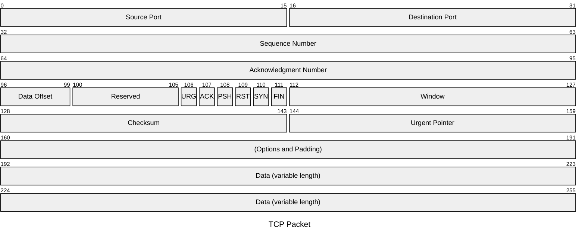

# Packet SVG Generator

The **Packet SVG Generator** is a Python script that reads a Mermaid-like syntax file describing a packet structure (e.g., a TCP packet), parses it, and generates an SVG diagram visualizing the packet layout. The script automatically computes an optimal layout based on the bit size of the packet and its fields.

## Features

- Parses Mermaid-like syntax for packet descriptions.
- Verifies that the total number of bits is a power of two.
- Automatically calculates an appropriate layout (number of rows and bits per row) based on field sizes.
- Avoids duplicate labels when fields span multiple rows.
- Uses `argparse` for simple command-line usage.

## Requirements

- Python 3.x (No additional libraries required beyond the Python standard library)

## Installation

Clone this repository or download the `packet_svg_generator.py` script to your local machine.

## Usage

Run the script using Python, providing the input file containing Mermaid-like syntax and specifying the output SVG file:

```bash
python packet_svg_generator.py input_file.txt output_file.svg
```

For example:

```bash
python packet_svg_generator.py tcp_packet.txt tcp_packet.svg
```

This command reads the packet description from `tcp_packet.txt` and produces an SVG diagram saved as `tcp_packet.svg`.

## Input Language

The input file should contain a Mermaid-like description of the packet structure. The language consists of:

- **YAML front matter** for metadata (like the title).
- Lines describing fields with bit ranges and labels.

### Input Structure

```
---
title: "Packet Title"
---
packet-identifier
start-end: "Field Label"
...
```

- **YAML Front Matter**: Delimited by `---`. Use this section to provide metadata. For example:
  ```yaml
  ---
  title: "TCP Packet"
  ---
  ```
- **Packet Identifier** (optional): A line after the YAML front matter may identify the packet (e.g., `packet-beta`).
- **Field Definitions**: Each subsequent line defines a field with a bit range and a label:
  - Use the format `start-end: "Field Label"` for multi-bit fields.
  - For single-bit fields, use `bit: "Field Label"`.

### Example Input



## How the Input Language Works

1. **Metadata and Structure**: 
   - The YAML section at the top specifies the packet title.
   - The lines after the YAML section define the packet's fields, each with a bit range and a descriptive label.

2. **Bit Ranges**:
   - Each field definition specifies which bits belong to that field (e.g., `0-15` indicates bits 0 through 15).
   - Fields can span multiple bits, and single-bit fields are specified with a single number.

3. **Power-of-Two Requirement**:
   - The script expects the total bit length of the packet to be a power of two (e.g., 256 bits).
   - It uses this requirement to validate the input and to calculate an optimal layout for the SVG diagram.

4. **Layout Calculation**:
   - The script finds the width of the largest field.
   - It then chooses the smallest power of two for `bits_per_row` that is at least as large as the largest field width and that evenly divides the total number of bits.
   - The number of rows is calculated as `total_bits / bits_per_row`.
   - For example, with a total of 256 bits and the largest field being 32 bits, the script selects 32 bits per row, resulting in 8 rows.

5. **SVG Generation**:
   - The script organizes fields into rows based on the calculated layout.
   - It draws rectangles for each field, places labels inside the rectangles, and positions bit indicators at the top.
   - The final output is a clear, scalable SVG representation of the packet structure.
